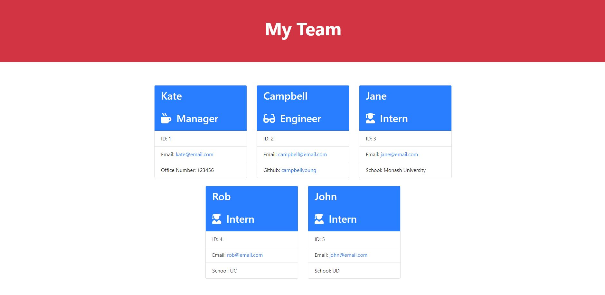

# Team Profile Generator

## Description
To build a Node.js command-line application that takes in information about employees on a software engineering team. This then generates an HTML webpage that displays summaries for each person.

### Video Link: 
https://drive.google.com/file/d/1Hb2hd6ihRz5mbuw5J1d8DFRvZFKWrJRo/view

## Table of Contents
- [User Story](#user-story)
- [Acceptance Criteria](#acceptance-criteria)
- [Mock-Up](#mock-up)
- [Installation](#installation)
- [Run Test](#run-test)
- [Usage](#usage)
- [Results](#results)
- [Contribution](#contribution)
- [License](#license)
- [Questions](#questions)

## User Story

```md
AS A manager
I WANT to generate a webpage that displays my team's basic info
SO THAT I have quick access to their emails and GitHub profiles
```

## Acceptance Criteria

```md
GIVEN a command-line application that accepts user input
WHEN I am prompted for my team members and their information
THEN an HTML file is generated that displays a nicely formatted team roster based on user input
WHEN I click on an email address in the HTML
THEN my default email program opens and populates the TO field of the email with the address
WHEN I click on the GitHub username
THEN that GitHub profile opens in a new tab
WHEN I start the application
THEN I am prompted to enter the team manager’s name, employee ID, email address, and office number
WHEN I enter the team manager’s name, employee ID, email address, and office number
THEN I am presented with a menu with the option to add an engineer or an intern or to finish building my team
WHEN I select the engineer option
THEN I am prompted to enter the engineer’s name, ID, email, and GitHub username, and I am taken back to the menu
WHEN I select the intern option
THEN I am prompted to enter the intern’s name, ID, email, and school, and I am taken back to the menu
WHEN I decide to finish building my team
THEN I exit the application, and the HTML is generated
```

## Mock-Up

The following image shows a mock-up of the generated HTML’s appearance and functionality:


## Installation
npm install

## Run Test
jest

## Usage
node index.js

## Results



## License
MIT License

Copyright (c) 2021 Kate McColl

## Contribution
Open to contributions

## Questions
If you have any questions, please contact me by Email: kate@katemccollart.com GitHub: [katemccoll](https://github.com/katemccoll)
